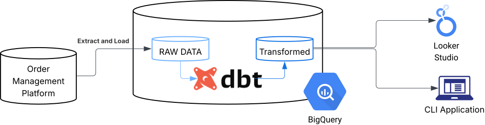

# From Spreadsheets to the Cloud: Automating Revenue Accounting

*MSc Computer Science Capstone Project — University of London*

---

## Overview

Large-scale digital marketplaces generate enormous volumes of financial data — and the accounting processes that support them need to keep up. This project examined that challenge first-hand, diagnosing a fragmented, spreadsheet-heavy operation inside a platform processing hundreds of millions of transactions annually, and delivering a working cloud-based solution to modernise and automate it.

The project was implemented within the platform accounting team at a leading online food delivery platform operating across **17 countries** and processing **140+ million orders** in 2024. Each order generates multiple financial microtransactions — all of which must be accurately captured, enriched, reconciled, and reported to the general ledger.

The team's existing system relied on a combination of a bespoke ETL script, a customised accounting integration, and extensive manual spreadsheet work to fulfil its responsibilities across journal entries, reconciliations, audit support, and stakeholder reporting. Manual processes increased turnaround times, introduced risk of error, and were not scalable given the size and complexity of the datasets involved.

### Approach

Following an enterprise architecture gap analysis (TOGAF framework), three work packages were defined to migrate the team from a monolithic, manual workflow to a modular, automated cloud system:

- **Project A — Master Data Harmonisation:** Migration of data storage and processing to Google BigQuery using dbt
- **Project B — Stakeholder Reporting:** Interactive business intelligence dashboards built in Google Looker Studio
- **Project C — Automation Platform:** A Python command line application (`gforevpy`) to automate journal entries, reconciliations, and audit support



### Results

| Process | Before | After |
|---|---|---|
| Journal entry (per account) | ~60 minutes | < 5 minutes |
| Reconciliation (per account) | ~180 minutes | < 5 minutes |
| Annual labour saving | — | 350+ hours |

**Stack:** Python · SQL (dbt) · JavaScript · Google BigQuery · Google App Scripts · Google Looker Studio · JupyterLab · SQLite · Git

---

## Documentation

| | |
|---|---|
| [📋 Full Project Report](_pages/report.md) | Business context, architecture decisions, and results in depth |
| [🗄️ Data Model](_pages/data.md) | dbt project structure, transformation layers, SQL patterns, and data quality testing |
| [⚙️ Workflows](_pages/workflows.md) | Google App Scripts — automated data extraction and continuous monitoring |
| [💻 CLI Application](_pages/cli.md) | Python package design, OOP architecture, and command reference |
| [📊 Stakeholder Reporting](_pages/bi.md) | Looker Studio dashboards — design, data model, and key metrics |

---

## The Data Model

Built in **Google BigQuery** and powered by **dbt**, the data model transforms raw event-level platform transaction data into structured, auditable financial data through five sequential layers.

```
Raw Transactions → Staging → Intermediate → Enrichment → Aggregation → Presentation
```

Revenue is processed across two streams — **B2C consumer delivery fees** and **B2B partner invoicing** — each with dedicated staging, intermediate, and aggregation models. Data quality assertions are materialised as BigQuery tables and evaluated daily by an automated monitoring workflow.

**Performance highlight:** Materialising the partner invoicing aggregation as a physical BigQuery table reduced query time from **8 minutes to 1 second**.

[View full data model documentation →](_pages/data.md)

---

## The CLI Application

`gforevpy` is a Python CLI package that connects the platform accounting team directly to BigQuery data. It automates the end-to-end production of journal entry files, reconciliation workbooks, and audit-ready HTML reports.

```bash
# Produce journal entry for August 2025 — Commission Revenue
gforevpy journal 2025 8 1

# Produce reconciliation workpaper for August 2025 — account 4100
gforevpy reconciliation 2025 8 4100
```

The application is built around an abstract base class `Process`, with concrete implementations for journal (`ProcessMECJournal`) and reconciliation (`ProcessRecon`) workflows. This OOP design makes the system both testable and extensible.

[View full CLI documentation →](_pages/cli.md)

---

## Automated Workflows

Two Google App Scripts workflows run on scheduled triggers without manual intervention:

1. **Accounting Data Extraction** — Pulls posted journal lines from Workday into BigQuery via REST API, per company entity, on a time-to-close schedule
2. **Continuous Monitoring** — Runs data quality assertions daily; materialises BigQuery tables if all checks pass, or sends an alert email if any fail

[View full workflow documentation →](_pages/workflows.md)

---

## Stakeholder Reporting

Interactive dashboards built in Google Looker Studio replace ad hoc email requests with self-service, on-demand reporting. Connected directly to the BigQuery data model, each dashboard delivers:

- **Periodic overview** of account balances by market and revenue category
- **Month-on-month variance analysis** with price and volume decomposition
- **Geographic breakdown** with country-level filtering

[View BI documentation →](_pages/bi.md)

---

📄 [Read the full project report →](_pages/report.md)
